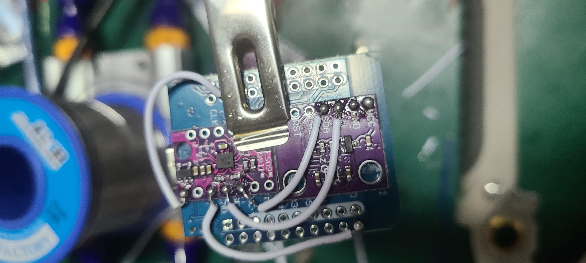

# **NekoSlime VR Motion Capture System**

English | [中文](README.zh-CN.md) 

---

## **1. Project Overview**

This project is based on **ESP32 + BMI160 + AK09911C** sensors, compatible with the **SlimeVR protocol**, enabling full-body tracking and virtual reality interaction.

---

## **2. Bill of Materials**

| Item                | Quantity | Image                                                      |
| ------------------- | -------- | ---------------------------------------------------------- |
| ESP32 Mini Board    | 6        |  |
| Wires for Soldering | Several  | -                                                          |
| BMI160 Sensor       | 5        |   |
| AK09911C Sensor     | 5        |    |
| 3D Printed Case     | 5        | -                                                          |
| Battery             | 5        |   |
| Charging Module     | 5        |   |
| Switch              | 5        |            |

---

## **3. Hardware Connection Steps**

> ⚠ **Note**: The sensors must be aligned strictly as shown in the example to ensure consistent orientation. It is recommended to use thinner jumper wires for easier wiring.

### **3.1 Battery and Charging Module**


---

### **3.2 Sensor Placement**

* Fix the **BMI160** sensor on the **upper back side of the ESP32** using double-sided tape.
* All sensors must be aligned neatly.

  

---

### **3.3 Sensor Wiring**

1. Connect BMI160 VCC

   

2. Connect BMI160 GND

   

3. Connect BMI160 SCL

   

4. Connect BMI160 SDA

   

5. Connect AK09911C GND

   

6. Connect SCL and SDA to ESP32 GPIO21 (SCL) and GPIO22 (SDA) respectively

   

7. Connect AK09911C VCC

   

8. Connect AK09911C RST to ESP32 3.3V (Very important; otherwise, sensor will not work)

   

---

### **3.4 Final Assembly Check**


---

### **3.5 Switch and Battery Connection**

* Connect as shown in the picture

  

---

### **3.6 Fixing the Board**

* Fix the board flat and securely with hot glue as shown

  

---

### **3.7 Charging Module**


---

### **3.8 Switch**


---

### **3.9 Wiring Red and Blue Wires**

1. Pass red and blue wires through the case

   

2. Connect blue wire to GND

   

3. Connect red wire to VCC

   

---

### **3.10 Complete One Unit**

* Make **6 sets** this way (1 host + 5 slaves)

  

---

## **4. Firmware Installation**

### **4.1 Install MicroPython**

1. Download and install [Thonny IDE](https://thonny.org/)
2. Download MicroPython firmware ([Download Link](https://micropython.org/download/))

   * Choose **ESP32** version and download the latest stable `.bin` file
3. Connect ESP32 to PC
4. Configure Thonny interpreter:

   * Tools → Options → Interpreter → Select “MicroPython (ESP32)”
   * Select the corresponding COM port
5. Flash the firmware:

   * Click “Install or update MicroPython”
   * Select `.bin` file and flash
6. Repeat for all 6 ESP32s

---

### **4.2 Host ESP32 Setup**

1. Open `host_main.py`
2. Modify Wi-Fi and PC connection settings:

```python
WIFI_SSID = "YourWiFiName"
WIFI_PASSWORD = "YourWiFiPassword"
PC_IP = "PC LAN IP"
PC_PORT = 12345
```

3. Upload `host_main.py` to host ESP32

---

### **4.3 Slave ESP32 Setup**

1. Upload the following files to each slave:

```
ak09911.py
bmi160.py
boot.py
fusion.py
main.py
```

2. Modify `TRACKER_ID` in `main.py` for each slave (0\~4)

---

## **5. PC Software Installation and Usage**

1. Ensure Python is installed on your PC
2. Run:

   * Script: `NekoSlimeReceiver.py`
   * Executable: `dist/NekoSlimeReceiver.exe`
3. Usage order:

   1. Turn on all ESP32 devices
   2. Each slave performs calibration: when blue LED flashes twice, place sensor flat for 10s, then blue LED flashes three times and enters magnetic calibration; move sensor in figure-8 pattern, then LED flashes 4 times and stays on.
   3. Start SlimeVR server
   4. Run NekoSlime receiver and click “Connect”
   5. Check if trackers are connected successfully in SlimeVR

---
# **NekoSlime VR モーションキャプチャーシステム**
---

## **1. プロジェクト概要**

本プロジェクトは **ESP32 + BMI160 + AK09911C** センサーをベースにしており、**SlimeVR プロトコル**に対応し、全身のトラッキングとVRインタラクションを実現します。

---

## **2. 部品リスト**

| 品目            | 数量 | 画像                                                         |
| ------------- | -- | ---------------------------------------------------------- |
| ESP32 ミニボード   | 6  |  |
| はんだ付け用ワイヤー    | 適量 | -                                                          |
| BMI160 センサー   | 5  |   |
| AK09911C センサー | 5  |    |
| 3Dプリントケース     | 5  | -                                                          |
| バッテリー         | 5  |   |
| 充電モジュール       | 5  |   |
| スイッチ          | 5  |            |

---

## **3. ハードウェア接続手順**

> ⚠ **注意**：センサーは必ずサンプルの向きに揃えて取り付けてください。向きが揃っていないと正しい動作ができません。細めのジャンパーワイヤーを使うことを推奨します。

### **3.1 バッテリーと充電モジュール**


---

### **3.2 センサーの配置**

* **BMI160** センサーを **ESP32の背面上部**に両面テープで固定します。
* センサーはすべて綺麗に揃えて配置してください。

  

---

### **3.3 センサー配線**

1. BMI160 VCC を接続

   

2. BMI160 GND を接続

   

3. BMI160 SCL を接続

   

4. BMI160 SDA を接続

   

5. AK09911C GND を接続

   

6. SCL と SDA をそれぞれ ESP32 の GPIO21（SCL）と GPIO22（SDA）に接続

   

7. AK09911C VCC を接続

   

8. AK09911C RST を ESP32 の 3.3V に接続（非常に重要。接続しないと動作しません）

   

---

### **3.4 全体の組み立て確認**


---

### **3.5 スイッチとバッテリーの接続**

* 写真のように接続してください

  

---

### **3.6 ボードの固定**

* ボードは平らにし、ホットボンドでしっかり固定してください。

  

---

### **3.7 充電モジュール**


---

### **3.8 スイッチ**


---

### **3.9 赤と青の配線**

1. 赤と青の線をケースの中に通します。

   

2. 青線をGNDに接続

   

3. 赤線をVCCに接続

   

---

### **3.10 1セット完成**

* この方法で **6セット** 作成してください（1台はホスト、5台はスレーブ）

  

---

## **4. ファームウェアのインストール**

### **4.1 MicroPythonのインストール**

1. [Thonny IDE](https://thonny.org/) をダウンロード・インストール
2. MicroPythonファームウェアをダウンロード（[リンク](https://micropython.org/download/)）

   * **ESP32** 用の最新版の `.bin` ファイルを選択
3. ESP32をPCに接続
4. Thonnyでインタプリタを設定：

   * ツール → オプション → インタプリタ → “MicroPython (ESP32)” を選択
   * 対応するCOMポートを選択
5. ファームウェアを書き込み：

   * “Install or update MicroPython” をクリック
   * `.bin` ファイルを選択して書き込み
6. 6台すべてのESP32で繰り返し

---

### **4.2 ホストESP32の設定**

1. `host_main.py` を開く
2. Wi-FiおよびPC接続設定を変更：

```python
WIFI_SSID = "あなたのWiFi名"
WIFI_PASSWORD = "あなたのWiFiパスワード"
PC_IP = "PCのLAN IPアドレス"
PC_PORT = 12345
```

3. `host_main.py` をホストESP32にアップロード

---

### **4.3 スレーブESP32の設定**

1. 各スレーブに以下のファイルをアップロード：

```
ak09911.py
bmi160.py
boot.py
fusion.py
main.py
```

2. `main.py` 内の `TRACKER_ID` をそれぞれ異なる値（0〜4）に設定

---

## **5. PCソフトのインストールと実行**

1. PCにPythonがインストールされていることを確認
2. 実行方法：

   * スクリプト：`NekoSlimeReceiver.py`
   * 実行ファイル：`dist/NekoSlimeReceiver.exe`
3. 実行手順：

   1. 全てのESP32を電源オン
   2. スレーブはキャリブレーションを実行：青LEDが2回点滅したらセンサーを平置きで10秒間待つ。次に青LEDが3回点滅し、磁気キャリブレーションへ移行。8の字を描くように動かし、完了するとLEDが4回点滅して点灯状態になる。
   3. SlimeVRサーバーを起動
   4. NekoSlime受信プログラムを起動し「接続」ボタンを押す
   5. SlimeVRでトラッカーが接続されているか確認する

---

