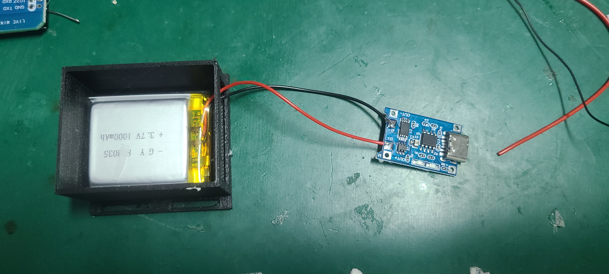
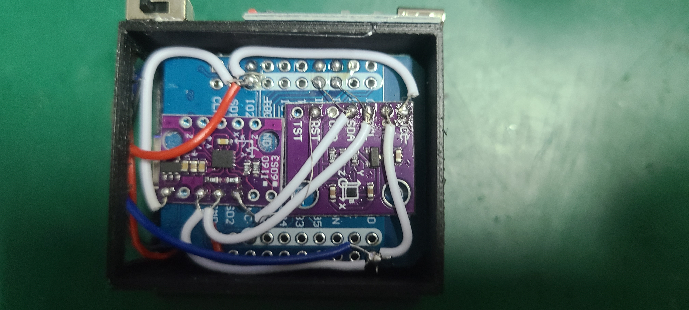

# **NekoSlime VR Motion Capture Solution**

[中文](README.zh.md) | English

---

## **1. Project Overview**

This project is based on **ESP32 + BMI160 + AK09911C** sensors, compatible with the **SlimeVR protocol**, enabling full-body tracking and interaction in virtual reality.

---

## **2. Bill of Materials**

| Item                  | Qty | Image                                                        |
| --------------------- | --- | ------------------------------------------------------------ |
| ESP32 mini dev board  | 6   |  |
| Wires for soldering   | —   | -                                                            |
| BMI160 sensor         | 5   |   |
| AK09911C sensor       | 5   |    |
| 3D printed case       | 5   | -                                                            |
| Battery               | 5   |   |
| Charging module       | 5   |   |
| Switch (triangle)     | 5   |            |

---

## **3. Hardware Assembly Steps**

> ⚠ **Note**: Sensors must be precisely aligned and positioned as shown in the example. Make sure all orientations are consistent. Use thin jumper wires for easier routing.

### **3.1 Battery & Charging Module**



---

### **3.2 Sensor Placement**

* Attach the **BMI160** sensor to the **upper back side** of the ESP32 (use double-sided tape).
* Ensure sensors are neatly aligned.

  

---

### **3.3 Sensor Wiring**

1. **Connect BMI160 VCC**

   

2. **Connect BMI160 GND**

   

3. **Connect BMI160 SCL**

   

4. **Connect BMI160 SDA**

   

5. **Connect AK09911C GND**

   

6. **Connect SCL & SDA to ESP32 GPIO21 (SCL) and GPIO22 (SDA)**

   

7. **Connect AK09911C VCC**

   

8. **Connect AK09911C RST to ESP32 3.3V** (Important: Without this, the sensor will not work)

   

---

### **3.4 Final Assembly Check**


---

### **3.5 Switch & Battery Wiring**

* Connect according to the diagram

  

---

### **3.6 Board Mounting**

* Mount the board flat and secure with hot glue as shown

  

---

### **3.7 Charging Module**


---

### **3.8 Switch**


---

### **3.9 Red & Blue Wire Routing**

1. Pass red and blue wires through the case

   

2. Blue wire → GND

   

3. Red wire → VCC

   

---

### **3.10 One Completed Unit**

* Make **6 sets** in total (1 host + 5 clients)

  

---

## **4. Firmware Installation**

### **4.1 Install MicroPython**

1. **Download and install [Thonny IDE](https://thonny.org/)**
2. **Download MicroPython firmware** ([Download page](https://micropython.org/download/))

   * Choose the **ESP32** version and get the latest stable `.bin`
3. **Connect ESP32 to PC**
4. **Configure Thonny Interpreter**

   * Tools → Options → Interpreter → Select “MicroPython (ESP32)”
   * Choose the correct COM port
5. **Flash firmware**

   * Click “Install or update MicroPython”
   * Select `.bin` and flash
6. **Repeat for all 6 ESP32 boards**

---

### **4.2 Host ESP32 Setup**

1. Open `host_main.py`
2. Edit Wi-Fi and PC receiver settings:

```python
WIFI_SSID = "YourWiFiName"
WIFI_PASSWORD = "YourWiFiPassword"
PC_IP = "YourPC_LAN_IP"
PC_PORT = 12345
```

3. Upload `host_main.py` to the host ESP32

---

### **4.3 Client ESP32 Setup**

1. Upload the following files to each client:

```
ak09911.py
bmi160.py
boot.py
fusion.py
main.py
```

2. Edit `main.py` and set a unique `TRACKER_ID` (0–4 for each client)

---

## **5. PC Software Installation & Usage**

1. Ensure **Python** is installed on your PC
2. Run one of the following:

   * **Script**: `NekoSlimeReceiver.py`
   * **Executable**: `dist/NekoSlimeReceiver.exe`
3. **Startup order**:

   1. Power on all ESP32 boards
   2. Start the SlimeVR server
   3. Run NekoSlime Receiver and click “Connect”
   4. Check if trackers appear in SlimeVR

---
