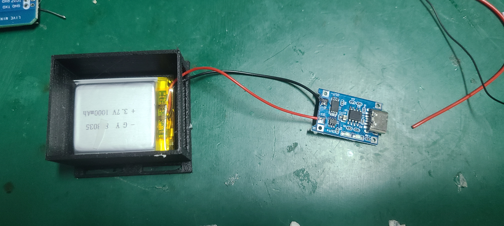

# NekoSlime

[English](README.md) | 中文

## 简介

基于 ESP32 + BMI160 + AK09911C 传感器的 VR 动作捕捉方案，兼容 SlimeVR 协议，可用于全身追踪与虚拟现实互动。

## 材料清单准备

*   ESP32 迷你开发板 * 6
*   焊接用的导线
*   BMI160 传感器 * 5
*   AK09911C 传感器 * 5
*   3D 打印外壳 * 5
*   电池 * 5
*   充电模块 * 5

## 硬件连接

**(这里将介绍 ESP32、BMI160、AK09911C、电池和充电模块之间的接线。)**

## 固件安装

### 1. 使用 Thonny 刷入 MicroPython

首先，您需要为所有的 ESP32 开发板刷入 MicroPython 固件。我们推荐使用 Thonny IDE 来完成这个步骤。

**详细步骤：**

1.  **下载并安装 Thonny：** 如果您尚未安装，请从 [Thonny 官网](https://thonny.org/) 下载并安装。
2.  **下载 MicroPython 固件：**
    *   访问 [MicroPython 下载页面](https://micropython.org/download/)。
    *   选择 “ESP32” 开发板的固件。下载最新的稳定版 `.bin` 文件。
3.  **连接您的 ESP32：** 将您的一个 ESP32 开发板通过 USB 数据线连接到电脑。
4.  **配置 Thonny 解释器：**
    *   在 Thonny 中，转到 `工具` > `选项...`。
    *   选择 `解释器` 选项卡。
    *   从解释器下拉列表中选择 “MicroPython (ESP32)”。
    *   选择您的 ESP32 对应的 COM 端口。如果找不到，您可能需要为您的开发板安装必要的驱动程序。
5.  **安装固件：**
    *   仍在解释器设置中，点击“安装或更新 MicroPython”。
    *   在弹出的窗口中，选择正确的目标端口，并浏览选择您之前下载的 `.bin` 文件。
    *   点击“安装”开始刷写固件。
    *   当该过程完成后，您会在 Thonny 的 shell 中看到 MicroPython 的 REPL 提示符 (`>>>`)。
6.  **为所有开发板重复操作：** 为您的全部六个 ESP32 开发板重复此过程。

### 2. 主机 ESP32 设置 (1个)

主机 ESP32 负责从所有追踪器收集数据并将其发送到您的电脑。

1.  **在 Thonny 中打开 `host_main.py` 文件。**
2.  **配置网络设置：**
    *   在 `host_main.py` 中找到第 36-37 行（或相关的配置部分）。
    *   您需要填写您的 Wi-Fi 信息和运行 SlimeVR 服务器的电脑的 IP 地址。
        *   `WIFI_SSID`：您的 Wi-Fi 网络名称。
        *   `WIFI_PASSWORD`：您的 Wi-Fi 密码。
        *   `PC_IP`：您电脑的局域网 IP 地址。
        *   `PC_PORT`：NekoSlime 接收程序使用的端口号（默认为 `12345`）。
3.  **上传文件：** 将修改后的 `host_main.py` 保存到主机 ESP32。

### 3. 从机 ESP32 设置 (5个)

从机 ESP32 读取传感器数据并将其发送到主机。

1.  **连接一个从机 ESP32** 到您的电脑。
2.  **使用 Thonny 将以下文件上传**到 ESP32：
    *   `ak09911.py`
    *   `bim160.py`
    *   `boot.py`
    *   `fusion.py`
    *   `main.py`
3.  **配置追踪器 ID：**
    *   打开 `main.py` 文件。
    *   找到 `TRACKER_ID=x` 这一行。
    *   **关键一步：您必须为每个追踪器分配一个从 0 到 4 的唯一 ID。** 例如，第一个追踪器设置为 `TRACKER_ID=0`，第二个设置为 `TRACKER_ID=1`，以此类推。
4.  **重复操作：** 为所有五个从机 ESP32 重复这些步骤，确保每个都有唯一的 `TRACKER_ID`。

## 软件安装

PC 端的软件接收来自主机 ESP32 的追踪数据，并将其转发给 SlimeVR。

1.  **先决条件：** 如果您希望直接运行脚本，请确保您的 PC 上已安装 Python。
2.  **选择您的运行方式：**
    *   **使用 Python 脚本：** 运行 `NekoSlime接收程序.py`。
    *   **使用可执行文件：** 为了方便使用，您可以直接运行 `dist` 文件夹中的 `NekoSlime接收程序.exe`。
3.  **与 SlimeVR 的集成：** 在连接 NekoSlime 接收程序**之前**，请确保 SlimeVR 服务器正在您的 PC 上运行。

## 运行

1.  **打开**您所有的 ESP32 追踪器和主机 ESP32 的电源。
2.  在您的电脑上**启动 SlimeVR 服务器**。
3.  在您的电脑上**运行 NekoSlime 接收程序**（`.py` 或 `.exe`）并点击“连接”。
4.  现在您应该能在 SlimeVR 中看到追踪器出现，可以在您的 VR 应用中进行全身追踪了。
