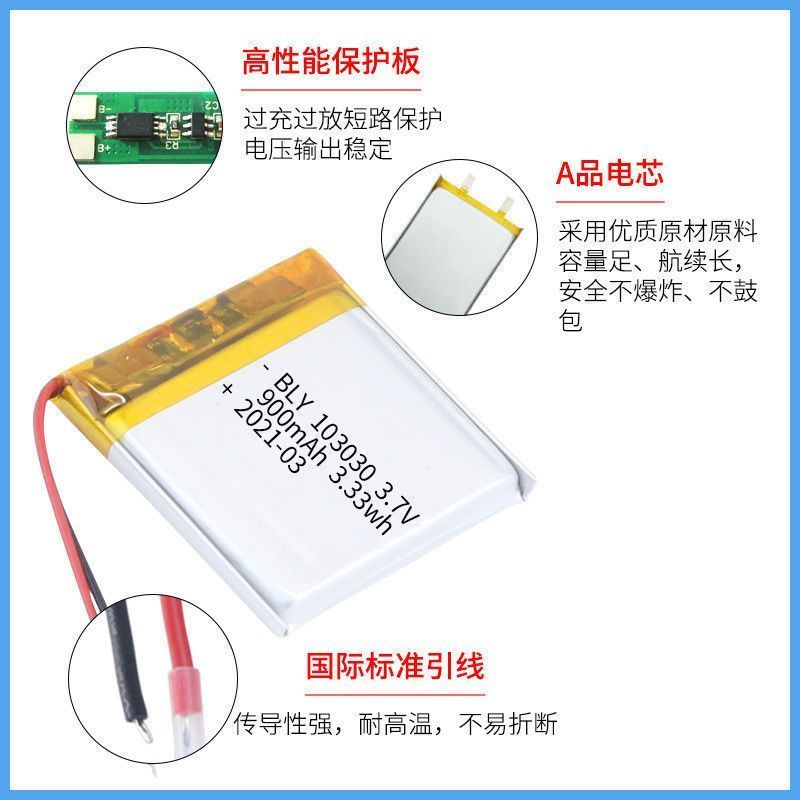
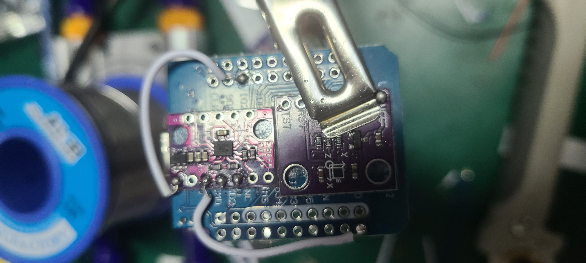
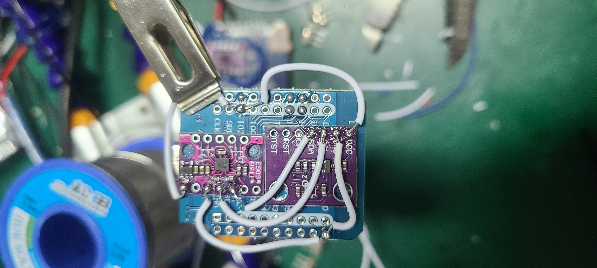
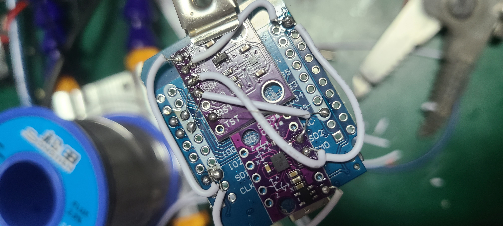
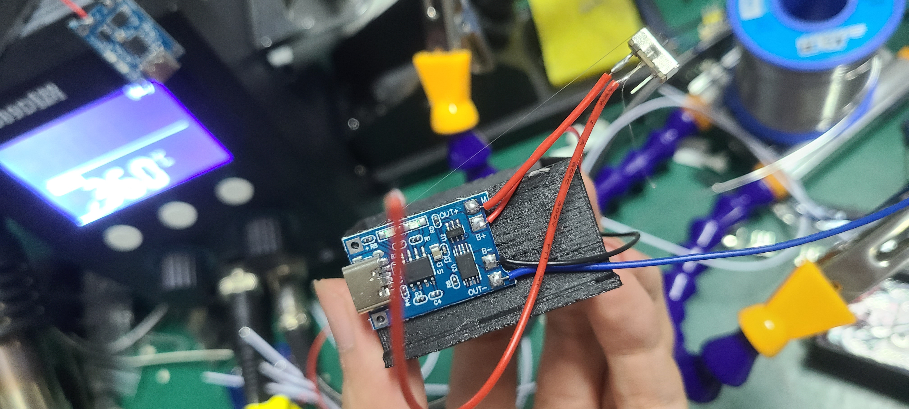

# NekoSlime

[English](README.md) | 中文

---

## 简介

基于 **ESP32 + BMI160 + AK09911C** 传感器的 VR 动作捕捉方案，**兼容 SlimeVR 协议**，可实现全身追踪与虚拟现实互动。

---

## 材料清单准备

* ESP32 迷你开发板 × 6 

* 焊接用导线

* BMI160 传感器 × 5 

* AK09911C 传感器 × 5 

* 3D 打印外壳 × 5

* 电池 × 5 

* 充电模块 × 5 

* 三角开关 

---

## 硬件连接

**本节介绍 ESP32、BMI160、AK09911C、电池与充电模块的接线方式。**

---

### 1. 电池与充电模块

先连接电池和充电模块： 

---

### 2. 传感器固定

将传感器严格按下图位置摆放在 **ESP32 背面**（可用双面胶固定）。
务必将 **BMI160 对齐上半部分**，各传感器保持整齐： 

---

### 3. 传感器焊接顺序（保持图片顺序）

1. 连接 BMI160 的 VCC 

2. 连接 BMI160 的 GND 

3. 连接 BMI160 的 SCL 

4. 连接 BMI160 的 SDA 

5. 连接 AK09911C 的 GND 

6. 将 SCL 与 SDA 接到 ESP32 的 SCL（GPIO21）与 SDA（GPIO22）
   （建议使用细一些的飞线） 

7. 连接 AK09911C 的 VCC 

8. 连接 AK09911C 的 RST 到 ESP32 的 3.3V
   （这一点很关键，没接会导致传感器无法工作） 

---

### 4. 检查与开关接线

* 最终效果（检查所有接线无误）： 

* 开关与电池连接（按图连接）： 

* 用热熔胶将板子平整固定： 

* 充电模块： 

* 开关： 

* 红蓝线穿入外壳： 

* 蓝线接 GND： 

* 红线接 VCC： 

---

### 5. 完成

重复制作 5 份，即可完成全部追踪器： 

---

## 固件安装

### 1. 使用 Thonny 刷入 MicroPython

1. **下载 Thonny**
   [Thonny 官网](https://thonny.org/)

2. **下载 MicroPython 固件**
   [MicroPython 下载页面](https://micropython.org/download/)
   选择 ESP32 最新稳定版 `.bin` 文件

3. **连接 ESP32**
   用 USB 数据线连接到电脑

4. **配置 Thonny 解释器**

   * 工具 → 选项 → 解释器
   * 选择 **MicroPython (ESP32)**
   * 选择对应的 COM 端口

5. **刷入固件**

   * 点击 “安装或更新 MicroPython”
   * 选择 `.bin` 文件并安装

6. **为 6 块 ESP32 全部重复以上操作**

---

### 2. 主机 ESP32 设置（1个）

* 打开 `host_main.py`
* 修改 Wi-Fi 信息与 PC IP（SlimeVR 服务器所在电脑）

  ```python
  WIFI_SSID = "你的WiFi名称"
  WIFI_PASSWORD = "你的WiFi密码"
  PC_IP = "你的电脑局域网IP"
  PC_PORT = 12345  # 默认端口
  ```
* 上传到主机 ESP32

---

### 3. 从机 ESP32 设置（5个）

* 上传以下文件：

  ```
  ak09911.py
  bim160.py
  boot.py
  fusion.py
  main.py
  ```
* 修改 `main.py` 中的追踪器 ID：

  ```python
  TRACKER_ID = 0  # 每个从机唯一，范围 0~4
  ```

---

## 软件安装（PC端）

* **运行方式**

  * Python 脚本：`NekoSlime接收程序.py`
  * EXE 文件：`dist/NekoSlime接收程序.exe`

* **启动顺序**

  1. 先运行 SlimeVR 服务器
  2. 再运行 NekoSlime 接收程序并点击 “连接”

---

## 使用步骤

1. 打开所有 ESP32 追踪器与主机电源
2. 启动 SlimeVR 服务器
3. 运行 NekoSlime 接收程序并连接
4. 在 VR 中进行全身追踪

---

