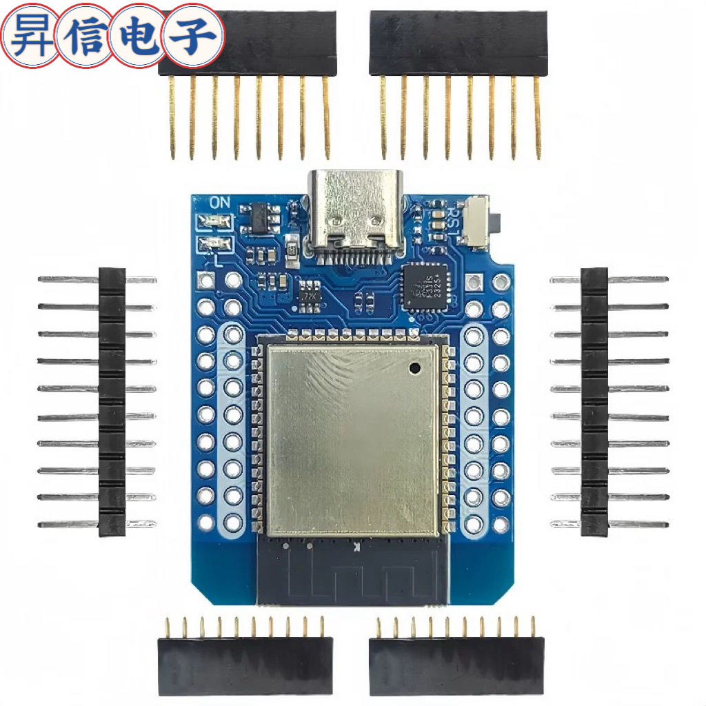
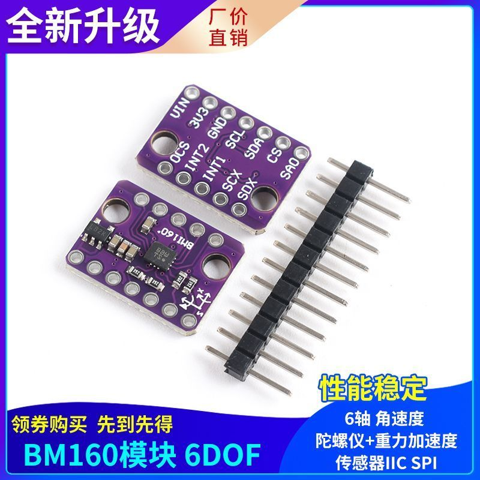
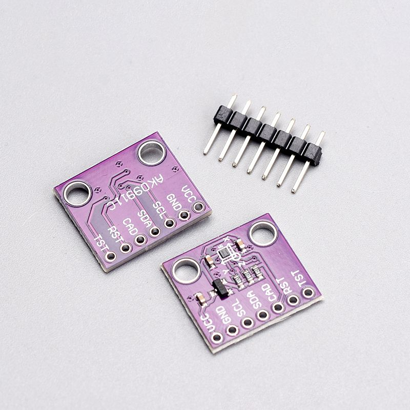

# NekoSlime

**中文** | [English](README.en.md)

## 简介 / Introduction

**中文：**  
基于 ESP32 + BMI160 + AK09911C 传感器的 VR 动作捕捉方案，兼容 SlimeVR 协议，可用于全身追踪与虚拟现实互动。  

**English:**  
A VR motion capture solution based on ESP32 + BMI160 + AK09911C sensors, compatible with the SlimeVR protocol, suitable for full-body tracking and virtual reality interaction.

---

## 材料清单 / Bill of Materials

| 名称 / Item | 数量 / Qty | 图片 / Image |
| :--- | :---: | :--- |
| ESP32 迷你开发板 / ESP32 Mini Dev Board | 6 |  |
| BMI160 传感器 / BMI160 Sensor | 5 |  |
| AK09911C 传感器 / AK09911C Sensor | 5 |  |
| 3D 打印外壳 / 3D Printed Case | 5 | *(无图 / No Image)* |
| 电池 / Battery | 5 |  |
| 充电模块 / Charging Module | 5 |  |
| 开关 / Switch | 5 |  |
| 焊接用导线 / Wires for Soldering | 若干 / Several | *(无图 / No Image)* |

---

## 硬件连接 / Hardware Assembly

> **提示 / Note：** 焊接需谨慎，确保连接牢固、无短路。

1. **传感器布局 / Sensor Placement**  
   - 将 BMI160 和 AK09911C 固定在 ESP32 背面（建议双面胶）。  
   - 需保持两传感器和 ESP32 上边缘平齐。  
   

2. **传感器间连接 / Sensor-to-Sensor Wiring**  
   - 对应连接 `VCC`, `GND`, `SCL`, `SDA`。  
   - 示例：  
     - **VCC:**   
     - **GND:**   
     - **SCL:**   
     - **SDA:**   

3. **传感器与 ESP32 连接 / Sensor-to-ESP32 Wiring**  
   - `SDA` → `GPIO22`  
   - `SCL` → `GPIO21`  
   - `RST` → `3.3V`（重要！）  
     

4. **电源模块组装 / Power Module Assembly**  
   - 电池 `B+`/`B-` → 充电模块  
   - 开关串联 `OUT+` → ESP32 `5V`  
   - `OUT-` → ESP32 `GND`  

5. **外壳组装 / Case Assembly**  
   - 固定电路板、充电模块、开关，连接电源线。

6. **重复制作 / Repeat for 5 Trackers**  
   - 总共需要 5 个从机追踪器。

---

## 固件安装 / Firmware Installation

### 1. 刷入 MicroPython / Flash MicroPython
1. 安装 [Thonny](https://thonny.org/)。  
2. 从 [MicroPython 官方下载](https://micropython.org/download/) ESP32 固件。  
3. 在 Thonny 选择 **工具 → 选项 → 解释器 → MicroPython (ESP32)**。  
4. 点击“安装或更新 MicroPython”，选择 `.bin` 文件，刷入固件。  

### 2. 主机 ESP32 / Host ESP32
1. 打开 `host_main.py`。  
2. 修改第 36-37 行配置：  
   ```python
   WIFI_SSID = 'NEKORAAA'
   WIFI_PASSWORD = '13875315563'
   PC_IP = '192.168.10.3'
   PC_PORT = 12345
   ```
   - `WIFI_SSID` / `WIFI_PASSWORD` → Wi-Fi 信息  
   - `PC_IP` → PC 局域网 IP  
   - `PC_PORT` → 端口（默认 12345）  
3. 上传到主机 ESP32。

### 3. 从机 ESP32 / Client ESP32
1. 上传以下文件：  
   ```
   ak09911.py
   bim160.py
   boot.py
   fusion.py
   main.py
   ```
2. 修改 `main.py` 中的：  
   ```python
   TRACKER_ID = x  # 0~4，每个从机唯一
   ```
3. 上传到 5 个从机。

---

## 软件安装 / Software Installation
- **方式 1（脚本运行）：** 运行 `NekoSlime接收程序.py`（需安装 Python）。  
- **方式 2（可执行文件）：** 运行 `dist/NekoSlime接收程序.exe`（无需 Python）。  
- **注意：** 运行前需启动 SlimeVR 服务器。

---

## 运行 / Run
1. 打开所有 ESP32（主机 + 从机）。  
2. 启动 SlimeVR 服务器。  
3. 运行 NekoSlime 接收程序并点击“连接”。  
4. 在 SlimeVR 中确认追踪器连接正常，即可在 VR 中使用全身追踪。

---
