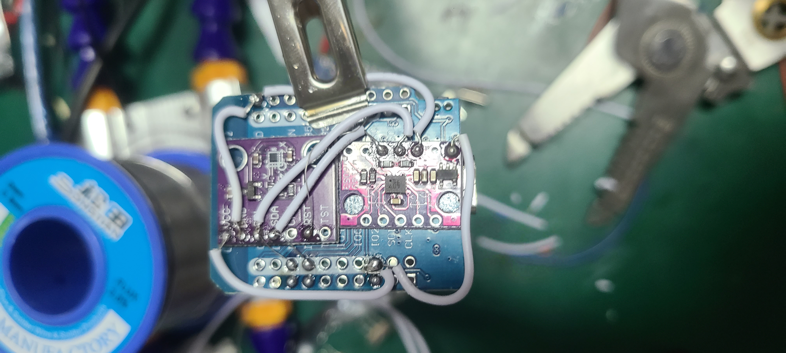
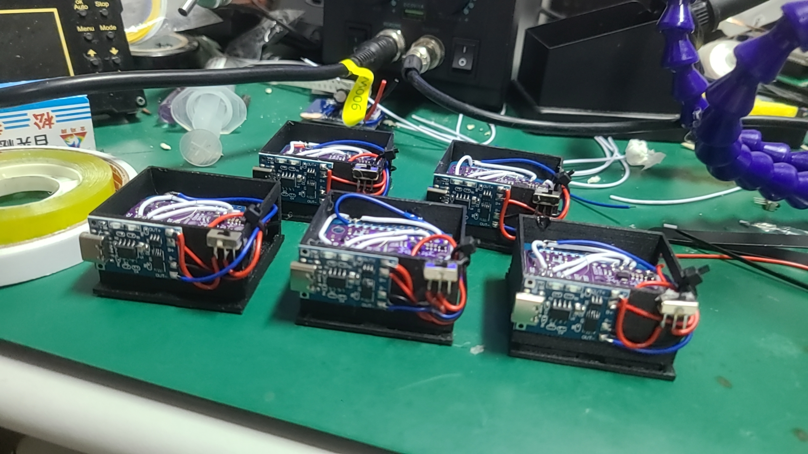

# NekoSlime

**中文** | [English](README.en.md)

## 简介

基于 ESP32 + BMI160 + AK09911C 传感器的 VR 动作捕捉方案，兼容 SlimeVR 协议，可用于全身追踪与虚拟现实互动。

## 材料清单准备

| 名称 | 数量 | 图片 |
| :--- | :--- | :--- |
| ESP32 迷你开发板 | 6 |  |
| BMI160 传感器 | 5 |  |
| AK09911C 传感器 | 5 |  |
| 3D 打印外壳 | 5 | |
| 电池 | 5 |  |
| 充电模块 | 5 |  |
| 开关 | 5 |  |
| 焊接用的导线 | 若干 | |

## 硬件连接

**注意：** 此过程需要焊接技巧。请仔细按照以下步骤操作，确保所有连接都牢固且无短路。

1.  **传感器布局与固定**
    *   将 BMI160 和 AK09911C 传感器放置在 ESP32 的背面，可以用双面胶临时固定。
    *   **重要提示:** 必须将 BMI160 传感器与 ESP32 的上半部分边缘对齐，且两个传感器之间也要对齐。精确的对齐对追踪效果至关重要。
    

2.  **焊接传感器之间的连接**
    *   将两个传感器的 `VCC`, `GND`, `SCL`, `SDA` 引脚一一对应连接起来。
    *   **VCC & VCC:** 
    *   **GND & GND:** 
    *   **SCL & SCL:** 
    *   **SDA & SDA:** 

3.  **连接传感器到 ESP32**
    *   使用较细的导线（飞线）将传感器的 `SCL` 和 `SDA` 总线连接到 ESP32 对应的引脚：
        *   `SDA` -> `GPIO22`
        *   `SCL` -> `GPIO21`
    

    *   **关键步骤:** 将 AK09911C 的 `RST` 引脚连接到 ESP32 的 `3.3V` 引脚。**请勿遗漏此步骤，否则传感器将无法正常工作！**
    

    *   焊接完成后，请仔细检查所有连接，最终效果应如下图所示：
    

4.  **电源模块组装**
    *   首先，将电池的正负极连接到充电模块的 `B+` 和 `B-`。
      
    *   将开关串联在充电模块的 `OUT+` 和 ESP32 的 `5V` (VCC) 引脚之间。
    *   将充电模块的 `OUT-` 连接到 ESP32 的 `GND` 引脚。
      

5.  **外壳组装**
    *   将焊接好的电路板用热熔胶固定在外壳底座上。**确保电路板放置平整。**
      
    *   固定充电模块和开关。
      
    *   将电源线从预留的孔中穿出，并将红线 (`+`) 和蓝线 (`-`) 分别连接到 ESP32 的 `5V` 和 `GND`。
      
      

6.  **大功告成**
    *   重复以上步骤，制作总共5个追踪器。
    

## 固件安装

### 1. 使用 Thonny 刷入 MicroPython

首先，您需要为所有的 ESP32 开发板刷入 MicroPython 固件。我们推荐使用 Thonny IDE 来完成这个步骤。

**详细步骤：**

1.  **下载并安装 Thonny：** 如果您尚未安装，请从 [Thonny 官网](https://thonny.org/) 下载并安装。
2.  **下载 MicroPython 固件：**
    *   访问 [MicroPython 下载页面](https://micropython.org/download/)。
    *   选择 “ESP32” 开发板的固件。下载最新的稳定版 `.bin` 文件。
3.  **连接您的 ESP32：** 将您的一个 ESP32 开发板通过 USB 数据线连接到电脑。
4.  **配置 Thonny 解释器：**
    *   在 Thonny 中，转到 `工具` > `选项...`。
    *   选择 `解释器` 选项卡。
    *   从解释器下拉列表中选择 “MicroPython (ESP32)”。
    *   选择您的 ESP32 对应的 COM 端口。如果找不到，您可能需要为您的开发板安装必要的驱动程序。
5.  **安装固件：**
    *   仍在解释器设置中，点击“安装或更新 MicroPython”。
    *   在弹出的窗口中，选择正确的目标端口，并浏览选择您之前下载的 `.bin` 文件。
    *   点击“安装”开始刷写固件。
    *   当该过程完成后，您会在 Thonny 的 shell 中看到 MicroPython 的 REPL 提示符 (`>>>`)。
6.  **为所有开发板重复操作：** 为您的全部六个 ESP32 开发板重复此过程。

### 2. 主机 ESP32 设置 (1个)

主机 ESP32 负责从所有追踪器收集数据并将其发送到您的电脑。

1.  **在 Thonny 中打开 `host_main.py` 文件。**
2.  **配置网络设置：**
    *   在 `host_main.py` 中找到第 36-37 行（或相关的配置部分）。
    *   您需要填写您的 Wi-Fi 信息和运行 SlimeVR 服务器的电脑的 IP 地址。
        *   `WIFI_SSID`：您的 Wi-Fi 网络名称。
        *   `WIFI_PASSWORD`：您的 Wi-Fi 密码。
        *   `PC_IP`：您电脑的局域网 IP 地址。
        *   `PC_PORT`：NekoSlime 接收程序使用的端口号（默认为 `12345`）。
3.  **上传文件：** 将修改后的 `host_main.py` 保存到主机 ESP32。

### 3. 从机 ESP32 设置 (5个)

从机 ESP32 读取传感器数据并将其发送到主机。

1.  **连接一个从机 ESP32** 到您的电脑。
2.  **使用 Thonny 将以下文件上传**到 ESP32：
    *   `ak09911.py`
    *   `bim160.py`
    *   `boot.py`
    *   `fusion.py`
    *   `main.py`
3.  **配置追踪器 ID：**
    *   打开 `main.py` 文件。
    *   找到 `TRACKER_ID=x` 这一行。
    *   **关键一步：您必须为每个追踪器分配一个从 0 到 4 的唯一 ID。** 例如，第一个追踪器设置为 `TRACKER_ID=0`，第二个设置为 `TRACKER_ID=1`，以此类推。
4.  **重复操作：** 为所有五个从机 ESP32 重复这些步骤，确保每个都有唯一的 `TRACKER_ID`。

## 软件安装

PC 端的软件接收来自主机 ESP32 的追踪数据，并将其转发给 SlimeVR。

1.  **先决条件：** 如果您希望直接运行脚本，请确保您的 PC 上已安装 Python。
2.  **选择您的运行方式：**
    *   **使用 Python 脚本：** 运行 `NekoSlime接收程序.py`。
    *   **使用可执行文件：** 为了方便使用，您可以直接运行 `dist` 文件夹中的 `NekoSlime接收程序.exe`。
3.  **与 SlimeVR 的集成：** 在连接 NekoSlime 接收程序**之前**，请确保 SlimeVR 服务器正在您的 PC 上运行。

## 运行

1.  **打开**您所有的 ESP32 追踪器和主机 ESP32 的电源。
2.  在您的电脑上**启动 SlimeVR 服务器**。
3.  在您的电脑上**运行 NekoSlime 接收程序**（`.py` 或 `.exe`）并点击“连接”。
4.  现在您应该能在 SlimeVR 中看到追踪器出现，可以在您的 VR 应用中进行全身追踪了。
