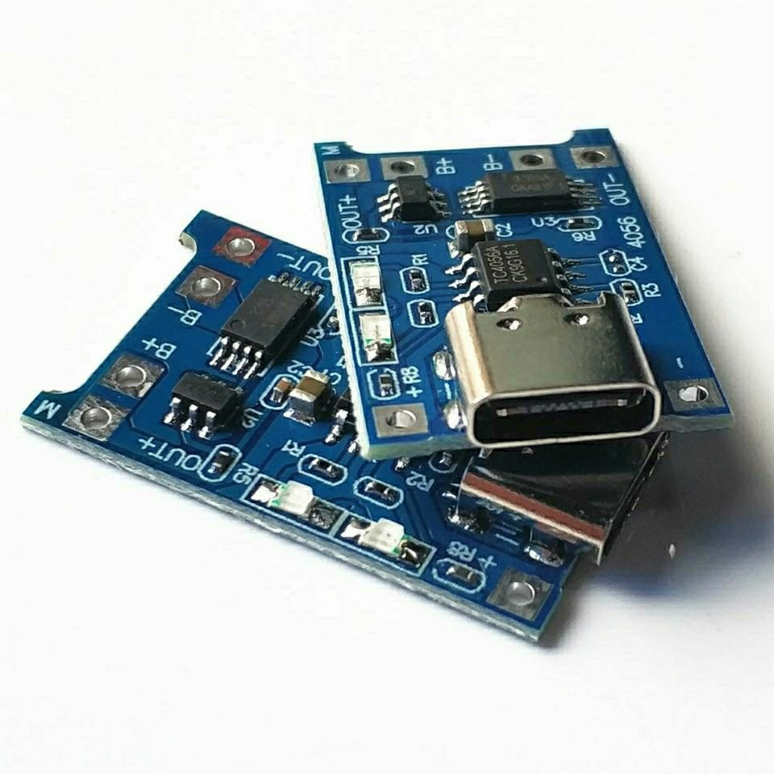
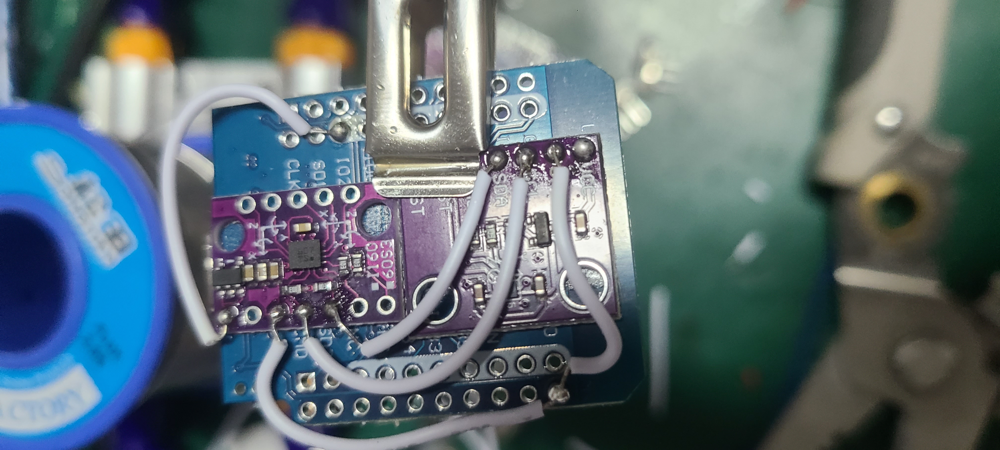
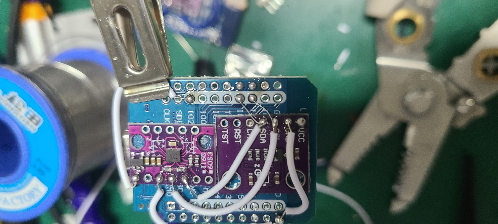
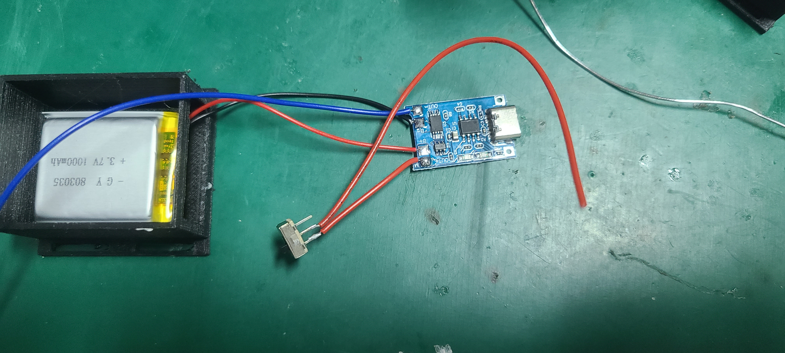

# **NekoSlime VR 动作捕捉方案**

[English](README.md) | 中文

---

## **1. 项目简介**

本项目基于 **ESP32 + BMI160 + AK09911C** 传感器，兼容 **SlimeVR 协议**，可实现全身追踪与虚拟现实互动。

---

## **2. 材料清单**

| 物品           | 数量 | 图片                                                         |
| ------------ | -- | ---------------------------------------------------------- |
| ESP32 迷你开发板  | 6  |  |
| 焊接用导线        | 若干 | -                                                          |
| BMI160 传感器   | 5  |   |
| AK09911C 传感器 | 5  |    |
| 3D 打印外壳      | 5  | -                                                          |
| 电池           | 5  |   |
| 充电模块         | 5  |   |
| 开关     | 5  |            |

---

## **3. 硬件连接步骤**

> ⚠ **注意**：传感器必须严格按照示例位置对齐摆放，确保方向一致。建议使用细一点的飞线，方便布线。

### **3.1 电池与充电模块**


---

### **3.2 传感器摆放**

* 将 **BMI160** 传感器固定在 **ESP32 背面上半部分**（用双面胶固定）。
* 传感器之间必须整齐对齐。

  

---

### **3.3 传感器连接**

1. **连接 BMI160 VCC**

   

2. **连接 BMI160 GND**

   

3. **连接 BMI160 SCL**

   

4. **连接 BMI160 SDA**

   

5. **连接 AK09911C GND**

   

6. **将 SCL 与 SDA 分别接到 ESP32 的 GPIO21（SCL）和 GPIO22（SDA）**

   

7. **连接 AK09911C VCC**

   

8. **连接 AK09911C RST 到 ESP32 3.3V**（非常重要，否则传感器无法工作）

   

---

### **3.4 检查总装**


---

### **3.5 开关与电池连接**

* 按图连接即可

  

---

### **3.6 板子固定**

* 板子需平整、严格按照下图方式用热熔胶固定

  

---

### **3.7 充电模块**


---

### **3.8 开关**


---

### **3.9 红蓝线布线**

1. 红蓝线穿过外壳

   

2. 蓝线连接 GND

   

3. 红线连接 VCC

   

---

### **3.10 完成一个单元**

* 按此方法制作 **6 套**（1 主机 + 5 从机）

  

---

## **4. 固件安装**

### **4.1 安装 MicroPython**

1. **下载并安装 [Thonny IDE](https://thonny.org/)**
2. **下载 MicroPython 固件**（[下载地址](https://micropython.org/download/)）

   * 选择 **ESP32** 版本，下载最新稳定版 `.bin` 文件
3. **连接 ESP32 到电脑**
4. **配置 Thonny 解释器**

   * 工具 → 选项 → 解释器 → 选择 “MicroPython (ESP32)”
   * 选择对应的 COM 端口
5. **刷写固件**

   * 点击“安装或更新 MicroPython”
   * 选择 `.bin` 文件并刷写
6. **为全部 6 个 ESP32 重复此过程**

---

### **4.2 主机 ESP32 配置**

1. 打开 `host_main.py`
2. 修改 Wi-Fi 与 PC 端接收设置：

```python
WIFI_SSID = "你的WiFi名称"
WIFI_PASSWORD = "你的WiFi密码"
PC_IP = "PC局域网IP"
PC_PORT = 12345
```

3. 上传 `host_main.py` 到主机 ESP32

---

### **4.3 从机 ESP32 配置**

1. 上传以下文件到每个从机：

```
ak09911.py
bmi160.py
boot.py
fusion.py
main.py
```

2. 修改 `main.py` 中的 `TRACKER_ID`（每个从机唯一，0\~4）

---

## **5. PC 软件安装与运行**

1. 确保 PC 安装 **Python**
2. 运行方式：

   * **脚本**：`NekoSlime接收程序.py`
   * **可执行文件**：`dist/NekoSlime接收程序.exe`
3. **运行顺序**：

   1. 打开全部 ESP32
   2. 启动 SlimeVR 服务器
   3. 运行 NekoSlime 接收程序并点击“连接”
   4. 在 SlimeVR 中查看追踪器是否连接成功

---
